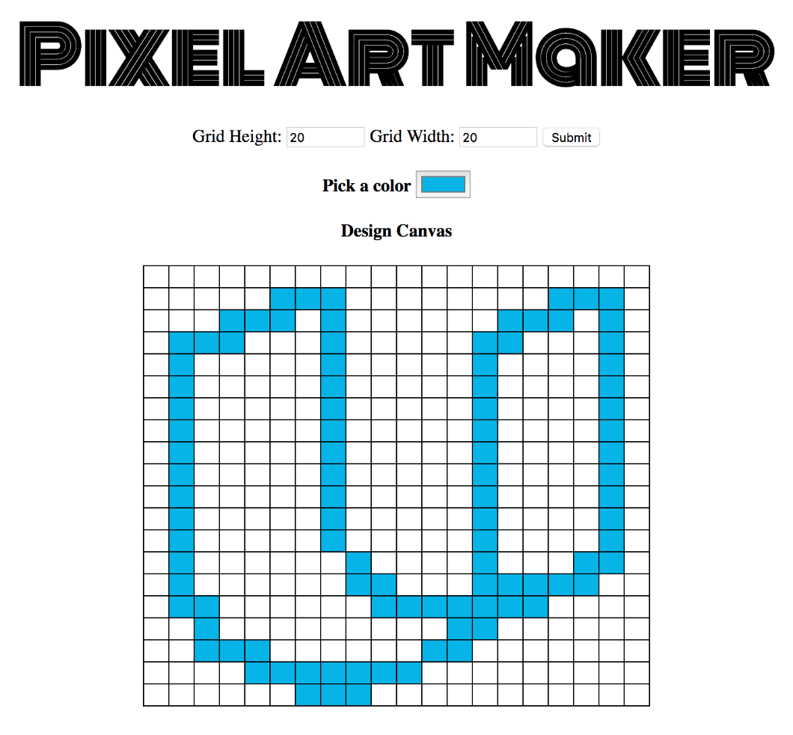

Live Project: https://bryanmiller89.github.io/pixel-art/

# Pixel Art Maker Project

## About:
* This single page web app was built using CSS, HTML, JavaScript, and jQuery.
* Allows users to draw pixel art on a customizable grid canvas.
* Purpose is to demonstrate an understanding of JavaScript event listeners and DOM manipulation.

## Instructions:
1. Set the canvas size by inputing the desired height and width in the input boxes. Click on submit when finished.
2. Select a color from the color picker by clicking on the box.
3. Click on a cell within the canvas grid to change it to the selected color.
4. Repeat steps 2 and 3 to complete your pixel design.

See what interesting designs you can come up with!

_To clear the grid, simply click on the submit button. You are free to change the canvas dimensions before hitting submit if you like_

## Dependencies:
* jQuery 3.3.1
* Google Fonts
